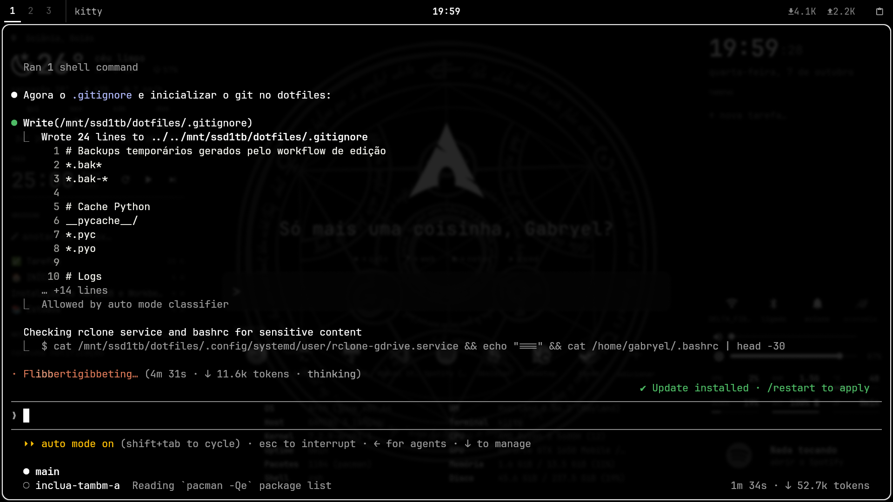

# dotfiles — Arch Linux + Hyprland

> Desktop minimalista preto e branco rodando Hyprland com config em Lua, waybar customizado, painel GTK welcome.py e dunst.



## Visão geral

| Componente | Software |
|---|---|
| Compositor | [Hyprland](https://hyprland.org/) (config em Lua) |
| Barra de status | [Waybar](https://github.com/Alexays/Waybar) |
| Painel desktop | `welcome.py` (GTK3 layer-shell, feito à mão) |
| Terminal | [Kitty](https://sw.kovidgoyal.net/kitty/) |
| Launcher | [Rofi](https://github.com/davatorium/rofi) (também integrado no welcome.py) |
| Notificações | [Dunst](https://dunst-project.org/) |
| Wallpaper | [Hyprpaper](https://github.com/hyprwm/hyprpaper) |
| Login | [SDDM](https://github.com/sddm/sddm) (tema blackarch) |
| Fontes | JetBrainsMono Nerd Font + Noto Fonts |
| Ícones | Adwaita |

## Estrutura de arquivos

```
.config/
├── hypr/
│   ├── hyprland.lua          # entry point (carrega os módulos abaixo)
│   ├── hyprpaper.conf        # wallpaper
│   ├── assets/
│   │   └── wallpaper.png
│   ├── config/               # módulos da configuração Hyprland
│   │   ├── variables.lua     # terminais, file manager, menu
│   │   ├── monitors.lua      # configuração de tela
│   │   ├── autostart.lua     # programas ao iniciar
│   │   ├── environment.lua   # variáveis de ambiente
│   │   ├── permissions.lua   # permissões de portais
│   │   ├── decorations.lua   # bordas, blur, sombra, opacidade
│   │   ├── animations.lua    # animações
│   │   ├── workspaces.lua    # workspaces
│   │   ├── misc.lua          # configurações diversas
│   │   ├── inputs.lua        # teclado, mouse, touchpad
│   │   ├── binds.lua         # atalhos de teclado
│   │   └── windowrules.lua   # regras de janela
│   └── scripts/
│       ├── welcome.py        # painel desktop GTK3 layer-shell
│       └── close-window.sh   # fecha janela (Spotify vai ao fundo)
├── waybar/
│   ├── config.jsonc          # configuração da barra
│   ├── style.css             # estilo
│   └── scripts/              # módulos customizados
│       ├── active-app.py     # app em foco
│       ├── clock-focus.py    # clock / timer de foco
│       ├── ws-daemon.py      # daemon de workspaces
│       ├── ws-button.sh      # botão de workspace
│       ├── net-speed.py      # velocidade de rede
│       ├── volume-mixer.py   # mixer de volume
│       ├── clipboard-menu.sh # histórico de área de transferência
│       ├── bluetooth-menu.sh # menu bluetooth
│       ├── wifi-menu.sh      # menu wi-fi
│       ├── powermenu.sh      # menu de energia
│       ├── claude-notify.sh  # notificações do Claude Code
│       └── ...
├── dunst/
│   └── dunstrc               # configuração de notificações
├── kitty/
│   └── kitty.conf            # terminal (preto e branco, JetBrains Nerd)
├── rofi/
│   ├── config.rasi
│   └── theme.rasi
└── fastfetch/
    └── config.jsonc
.config/
├── Kvantum/kvantum.kvconfig  # tema Qt (KvGnomeDark)
├── qt5ct/qt5ct.conf          # aparência Qt5 (Fusion + paleta B&W)
├── qt6ct/qt6ct.conf          # aparência Qt6
├── autostart/                # nm-applet
├── mimeapps.list             # associações de arquivos
├── user-dirs.dirs            # pastas XDG em português
└── systemd/user/
    ├── rclone-gdrive.service
    ├── rclone-drives-compartilhados.service
    ├── rclone-sync-drives-compartilhados.{service,timer}
    └── dbus-broker.service.d/limits.conf   # fix "too many open files"
.local/bin/
├── rclone-sync-drives-compartilhados       # sincroniza drives compartilhados
└── dbus-watch.sh                           # diagnóstico de fds dbus
sddm/
└── theme.conf                # tema do login manager (blackarch)
.zshrc / .bashrc / .bash_profile           # shell configs
pkg-explicit.txt / pkg-aur.txt             # lista de pacotes para reinstalação
```

## Atalhos de teclado principais

> `Super` = tecla Windows

| Atalho | Ação |
|---|---|
| `Super + Q` | Abre o painel / launcher |
| `Super + R` | Terminal (kitty) |
| `Super + E` | Gerenciador de arquivos (thunar) |
| `Super + Return` / `Alt + F4` | Fecha janela |
| `Super + F` | Fullscreen |
| `Super + Shift + V` | Float toggle |
| `Super + V` | Histórico de clipboard |
| `Super + P` | Pseudotile |
| `Super + J` | Toggle split |
| `Super + M` | Menu de energia |
| `Alt + Tab` | Troca de janela |
| `Ctrl + Shift + Esc` | btop |
| `Super + 1–9/0` | Vai para workspace |
| `Super + Shift + 1–9/0` | Move janela para workspace |
| `Super + Shift + S` | Screenshot de área (copia) |
| `Print` | Screenshot full (salva em ~/Pictures/Screenshots/) |
| `Super + Print` | Screenshot full (copia) |
| Teclas de mídia | Volume, brilho, play/pause/next/prev |

## Painel welcome.py

Painel GTK3 fixado no fundo via layer-shell. Não bloqueia o waybar.

- **Coluna esquerda:** clima, timer de foco (ativa DND do dunst), captura Obsidian, notificações
- **Centro:** launcher com prefixos (`=` → calculadora, `?` → web, `n ` → notas, `>` → comando) + favoritos
- **Coluna direita:** relógio, tarefas do Obsidian (`✅ Tarefas.md`), stats do sistema, player

Log: `~/.cache/welcome.log`

Reiniciar o painel:
```bash
pkill -f 'python3 -X faulthandler .*[w]elcome'
setsid -f sh -c 'python3 -X faulthandler ~/.config/hypr/scripts/welcome.py >>~/.cache/welcome.log 2>&1'
```

## Instalação

Veja [`INSTALL.md`](INSTALL.md) para o guia passo a passo com comandos individuais.

Execute o script automatizado:
```bash
bash install.sh
```

## Observações

- Monitor configurado para `preferred` + `auto` — ajuste `config/monitors.lua` para configurações fixas
- Wallpaper em `~/.config/hypr/assets/wallpaper.png` (1920×1080, fit_mode contain)
- SDDM usa o tema **blackarch** (instalado via AUR: `sddm-theme-blackarch`)
- Hyprland usa **Lua** como linguagem de configuração (recurso recente — exige Hyprland ≥ 0.50)
- O welcome.py lê tarefas do Obsidian Vault em `~/Obsidian Vault/✅ Tarefas.md`
